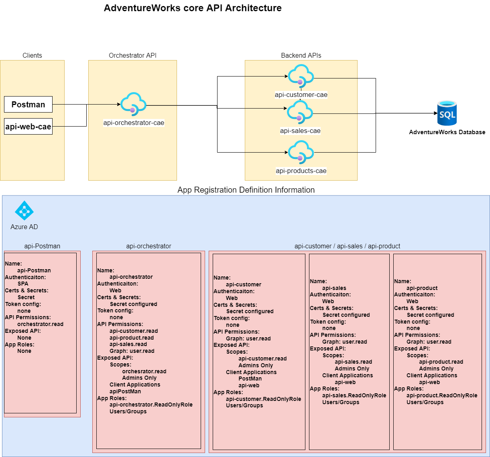

# CAE Hack

AdventureWorks has recently migrated some of their core APIs to the Azure App Service. They are using Azure Active Directory to protect them. However, they have not fully modernized the application. 

This is where YOU come in. We need you to help them on their modernization journey for the core APIs. 

## Architecture 

### AAD Tenant: mscae.microsoft.com

## Challenges
There are plenty of opportunities to help them modernize the APIs. Here are some of the challenges for you to accomplish in this hack. Pick as many as you like to try to accomplish. This list is not exhuastive, so if you see other opportunities to modernize in other areas, feel free to do so.

1. Containerize the app
1. Replace the Orchestrator API with APIM
1. Add App Gateway
1. Enable Multi-Tenant Auth
1. Enable Claims Based Auth
1. Build Similar App with Java, Node, or Python
1. Build a Power App that Calls the APIs
1. Automate deployment with Bicep/Terraform
1. Add Key Vault
1. Add Application Insights
1. Add App Config
